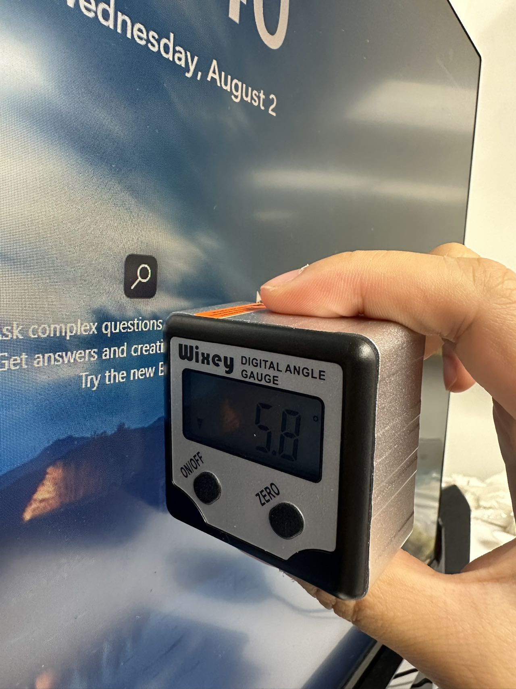
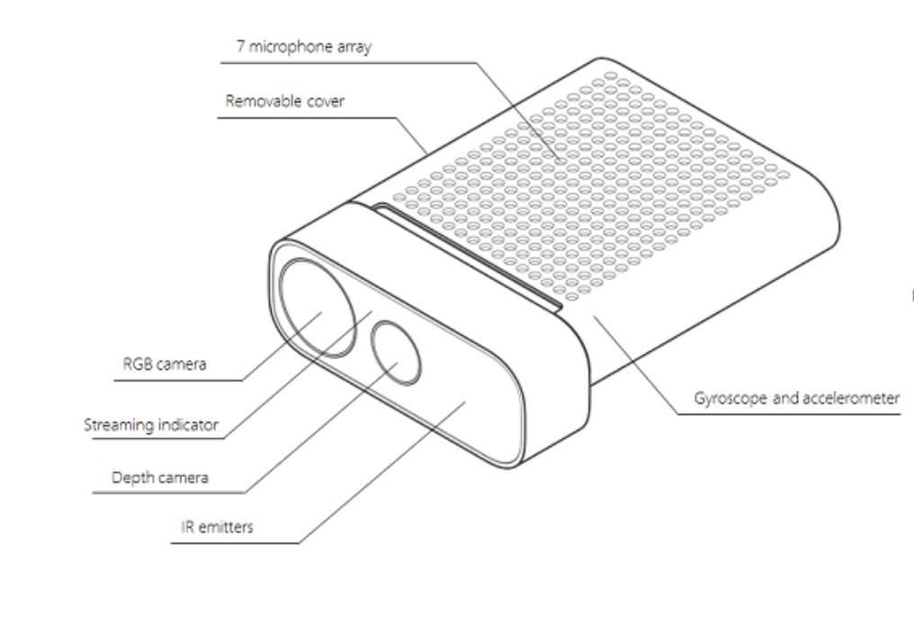

<!-- ABOUT THIS FOLDER -->
## About This Folder

This folder contains code that enables hand tracking using an Azure Kinect Camera and allows you to determine where users are pointing on a monitor screen.

<!-- GETTING STARTED -->
## Getting Started

This section provides instructions on setting up the project locally.

### Prerequisites

This project is built and tested using the following hardware:
- Microsoft Azure Kinect camera
- 24-inch Dell monitor

### Installation

1. Download this folder to your local computer.
2. Install the following SDKs:
   * Azure Kinect SDK v1.4.1 (already included in this folder). Download from: [Azure Kinect SDK](https://learn.microsoft.com/en-us/azure/kinect-dk/sensor-sdk-download)
   * Azure Kinect Body Tracking SDK v1.1.2 (*not* included in this folder due to large file size). Download from: [Azure Kinect Body Tracking SDK](https://learn.microsoft.com/en-us/azure/kinect-dk/body-sdk-download)
   * pyKinectAzure-master (Python library to run Kinect Azure DK SDK functions; already included in this folder). Download from: [pyKinectAzure](https://github.com/ibaiGorordo/pyKinectAzure)
   * hand-gesture-recognition-mediapipe (a sample Python program that recognizes hand gestures with a simple MLP using the detected key points; already included in this folder). Download from: [hand-gesture-recognition-mediapipe](https://github.com/kinivi/hand-gesture-recognition-mediapipe)
   
4. Install the necessary packages:
  ```
  pip install mediapipe
  pip install tensorflow
  pip install pykinect_azure
  ```

<p align="right">(<a href="#readme-top">back to top</a>)</p>

### Why so many SDKs and 2 tracking systems??!
We are using both MediaPipe and Azure Kinect to track hands for the following reasons:

* MediaPipe provides real-time location of all phalanges of our hands, but the x, y coordinates are in pixels, and the z coordinate represents the landmark depth, with the depth at the wrist being the origin. For more info on the coordinate system of MediaPipe, see the "Landmarks" section in [MediaPipe Gesture Recognizer](https://developers.google.com/mediapipe/solutions/vision/gesture_recognizer/python).

* Azure Kinect gives us real-world coordinates of joints in our body, and for hands, we can obtain positions of the wrist, tip of the index finger, and palm. Check out the [Azure Kinect Body Joints](https://learn.microsoft.com/en-us/azure/kinect-dk/body-joints) to see what joints are useful for hand tracking.

* To know where users are pointing, we must also know the real-world coordinates of other phalanges of our fingers. Therefore, we combine data from both cameras to calculate locations of other phalanges.

## Usage

To use this repository, run the **app.py** file in the folder **hand-gesture-recognition-mediapipe-master** with the Azure Kinect camera connected to your PC. All intersection points will be written to **intersection_points.csv**, and the existing data in the CSV file will be overwritten every time **app.py** is run.

Note that you have to specify the local paths to **k4a.dll** and **k4abt.dll** in **app.py** to run successfully.

**k4a.dll** can be found at: `/Azure Kinect SDK v1.4.1/sdk/windows-desktop/amd64/release/bin/k4a.dll` and 
**k4abt.dll** can be found at: `/azure—kinect-body-tracking-sdk/windows-desktop/amd64/release/bin/k4abt.dll`

To see where the pointing vector intersects with the monitor plane, run **draw_intersection_2d.py** or **draw_intersection_3d.py**.

<p align="right">(<a href="#readme-top">back to top</a>)</p>

<!-- DOCUMENTATION -->
## Documentation
To see which joints we track in the code:

- Joint IDs in MediaPipe: [MediaPipe Gesture Recognizer](https://developers.google.com/mediapipe/solutions/vision/gesture_recognizer) (scroll down to "Hand Landmark model bundle")
- Joint IDs in Azure Kinect Body Tracking: [Azure Kinect Body Joints](https://learn.microsoft.com/en-us/azure/kinect-dk/body-joints)

<p align="right">(<a href="#readme-top">back to top</a>)</p>

## Improve Accuracy

Several factors can influence the accuracy of the intersection points. If the positioning of the monitor and the Azure Kinect camera differs from the setup used in this project, you may need to make adjustments to the code. Consider the following aspects:

- The display of the 24'' Dell monitor has a resolution of 1920 x 1200 pixels.

- We utilize both the RGB camera and the depth camera of the Azure Kinect. Although they are on the same hardware, they are a few centimeters apart from each other, which could introduce some bias to the accuracy.

- The monitor must be tilted at a specific angle. In our code, we have set the angle to 6 degrees, and this measurement was obtained using a Digital Angle Gauge (see picture below). If you decide to change the angle, make sure to update the corresponding code, as it will affect the position of the monitor plane in 3D space.

<p align="center">
  
</p>

- We aligned the Azure Kinect depth camera (second camera from the left) to the center top of the monitor and assume it is positioned parallel to the floor. Achieving perfect alignment in real-life scenarios can be challenging, and using an adjustable tripod or other tools might help achieve better alignment.

<p align="center">
  
</p>

Please consider these factors and adjust the code accordingly to achieve optimal accuracy in determining the intersection points.

<p align="right">(<a href="#readme-top">back to top</a>)</p>
